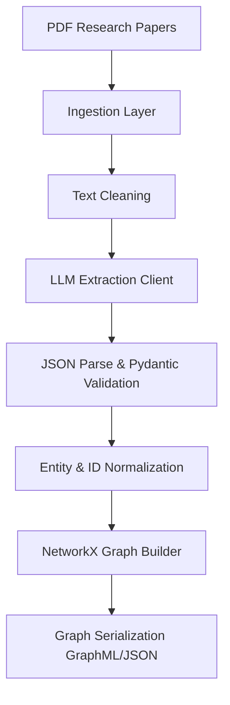

# GraphRAG Project Overview

## Executive Summary
This project aims to build a modular **GraphRAG (Graph-based Retrieval-Augmented Generation)** research paper knowledge graph assistant. The system ingests research papers in PDF format, uses Gemini LLM to extract structured entities (authors, methods, architectures, datasets, benchmarks, tasks, metrics, topics) and relationships, validates and normalizes these extractions, and constructs a NetworkX knowledge graph. The ultimate goal is to facilitate deep retrieval and reasoning over scientific literature by combining graph structures and text retrieval.

---

## Intended Goal & Core Idea
The core idea is to move beyond simple flat vector-based retrieval (traditional RAG) for scientific research papers, which often fails to capture the relationships between authors, institutions, tasks, methods, and results. By constructing a structured **Knowledge Graph (KG)**, the assistant can traverse connections (e.g., "Which methods improve upon the Transformer architecture and were evaluated on the GLUE benchmark?") and perform multi-hop reasoning.

---

## Business & Research Problems
1. **Business Problem:** Academic literature is expanding exponentially. Researchers, developers, and organizations spend days searching, reading, and synthesizing information across multiple papers. An automated tool is needed to build a structured index of scientific discoveries.
2. **Research Problem:** Information in research papers is highly interconnected. Traditional RAG relies on semantic similarity of text chunks, which loses structural semantics (e.g., source code dependencies, model ancestry, specific metric scores). GraphRAG attempts to preserve the ontology of research fields.

---

## Target Users & Expected User Journey
- **Target Users:** AI researchers, software engineers, and domain experts seeking to analyze collections of scientific papers.
- **Expected User Journey:**
  1. The user uploads a set of PDFs (e.g., research papers) into the ingestion directory.
  2. The pipeline automatically runs to parse, extract, normalize, and add the papers to a unified knowledge graph.
  3. The user queries the system using natural language.
  4. The system queries both the textual index and traverses the knowledge graph to return comprehensive, contextually rich answers.

---

## Features the Project Attempts to Provide
- **Automated PDF Ingestion:** Raw text extraction from PDFs using PyMuPDF and basic metadata extraction (page count, source path).
- **LLM-Based Entity & Relationship Extraction:** Prompts Gemini to identify key elements under an ontology (schema) of 11 node types and 10 relationship types.
- **Ontology Validation:** Verifies that extracted nodes and edges conform to allowed graph connections.
- **Entity Normalization:** Resolves duplicates and cleans naming formatting to ensure entity resolution.
- **Graph Serialization:** Saves and loads NetworkX MultiDiGraph in JSON and GraphML formats.
- **Visual Mapping:** Outputs an interactive HTML graph visualization using Pyvis.

---

## Current Implementation Status
The project is approximately **60% complete**. 

| Module | Status | Completeness |
| :--- | :--- | :--- |
| **Ingestion** | ✅ Complete | 100% |
| **LLM Interface** | ✅ Complete | 100% |
| **Extraction & Validation** | ✅ Complete | 95% |
| **Graph Builder** | 🚧 Partially Complete / Conflicting | 70% |
| **Graph Retrieval** | ❌ Missing | 0% |
| **Hybrid GraphRAG** | ❌ Missing | 0% |
| **Agent Routing** | ❌ Missing | 0% |
| **Evaluation Pipeline** | ❌ Missing | 0% |

---

## Missing Capabilities
- **Graph Retrieval / Search:** No query engine exists to retrieve facts or run traversals over the constructed NetworkX graph.
- **Vector Storage / Embeddings:** Lacks embedding models and vector search databases to perform hybrid RAG.
- **Agentic Routing:** No router to determine if a query requires graph traversal, vector search, or both.
- **Unified Graph Architecture:** The project has two conflicting graph construction architectures (`GraphBuilder` vs. `GraphManager`) that overlap and cause import errors or inconsistent APIs.
- **Multi-Paper Consolidation:** Current tests focus on single papers (e.g., "Attention Is All You Need") and lack robust cross-paper merging strategies.
