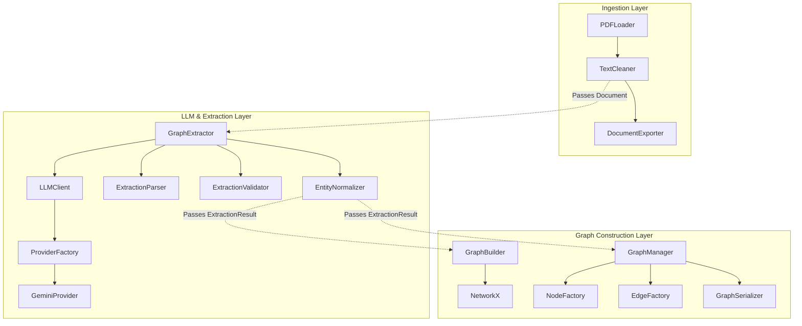
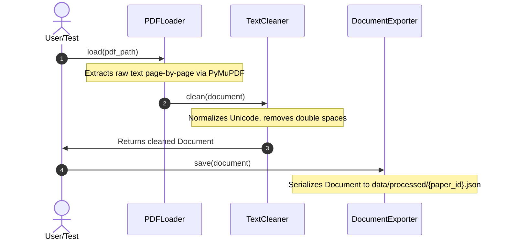
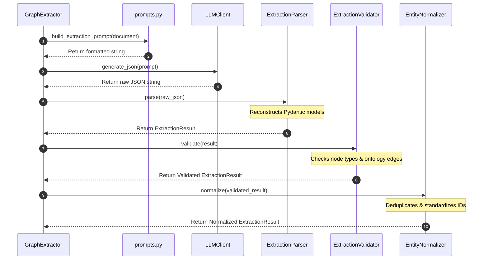

# GraphRAG System Architecture

This document details the system architecture of the GraphRAG Research Paper Assistant. It outlines the modules, data flows, and interactions between the components.

---

## 1. Overall System Architecture
The system is structured as a decoupled, multi-layered pipeline designed to convert unstructured PDFs into structured graphs and query them. The three primary layers currently implemented are:
1. **Ingestion Layer:** Extracts and cleans text from PDF files.
2. **LLM & Extraction Layer:** Leverages LLMs to extract schema-compliant entities and relationships.
3. **Graph Construction Layer:** Converts extracted data into a unified graph and handles serialization.

### Component Diagram
The system's modular layers communicate via clean, structured interfaces (like Pydantic models).



---

## 2. Component Hierarchy & Folder Responsibilities

```
d:\Work\PROJECTS\grph-rag-research
├── graph/
│   ├── ingestion/             # Load and clean PDF research papers
│   │   ├── loader.py          # PDF document text extractor (PyMuPDF)
│   │   ├── cleaner.py         # Whitespace and unicode text standardizer
│   │   ├── document.py        # Core dataclass representing a paper
│   │   └── exporter.py        # Saves/loads Document objects as JSON
│   │
│   ├── extraction/            # Extract knowledge from cleaned text
│   │   ├── schema.py          # Node/Relationship types and valid connections (Ontology)
│   │   ├── models.py          # Pydantic validation models
│   │   ├── parser.py          # Parses raw LLM JSON output to Pydantic models
│   │   ├── validator.py       # Validates extractions against schema.py
│   │   ├── normalizer.py      # Cleans entity names and updates graph IDs
│   │   └── extractor.py       # Main facade coordinating the extraction steps
│   │
│   └── graph_builder/         # Build and serialize NetworkX graphs
│       ├── builder.py         # In-memory graph constructor
│       ├── graph_manager.py   # Wrapper around NetworkX graph operations
│       ├── node_factory.py    # Node attributes helper
│       ├── edge_factory.py    # Edge creation and verification helper
│       ├── serializer.py      # Saves/loads graph as JSON/GraphML
│       └── utils.py           # Helper stats and deduplication routines
│
├── llm/                       # LLM Provider Abstraction
│   ├── client.py              # Main LLM client used by downstream modules
│   ├── config.py              # Environment configuration & validation
│   ├── prompts.py             # Prompt template definition
│   └── provider/              # Individual model providers
│       ├── base.py            # Base provider abstract base class
│       ├── factory.py         # Provider registration and retrieval
│       └── gemini.py          # Google GenAI SDK integration
│
└── tests/                     # Verification test scripts
```

---

## 3. Data Flow & Pipelines

### Ingestion Pipeline


### Knowledge Extraction Pipeline


---

## 4. Architectural Conflicts & Pipeline Gaps

### Architectural Mismatch in Graph Builder Layer
There are currently two conflicting graph architectures:
- **Architecture A (Functional & Simple):** `GraphBuilder` (`graph/graph_builder/builder.py`) builds a NetworkX `MultiDiGraph` directly from an `ExtractionResult`.
- **Architecture B (Partially Broken):** `GraphManager` (`graph/graph_builder/graph_manager.py`) wraps a NetworkX `MultiDiGraph` but depends on helper factories (`NodeFactory`, `EdgeFactory`). However, `GraphManager` attempts to call non-existent functions `create_node` and `create_edge` from `node_factory.py` and `edge_factory.py`, causing runtime crashes.

### Storage Pipeline
- In-memory representations use `networkx.MultiDiGraph`.
- Graph storage currently saves graphs to JSON or GraphML formats via `GraphSerializer.save()` or `GraphManager.save_graph()`.
- Note: There is a mismatch between old tests expecting `GraphSerializer(output_dir)` and the new class-method-based signature `GraphSerializer.save(graph, path)`.

### Missing Pipelines (Planned but not implemented)
1. **Retrieval Pipeline:** Currently, no code traverses the graph or queries it for downstream retrieval tasks.
2. **Embedding Pipeline:** No code exists to generate vectors for nodes or relationships.
3. **Hybrid RAG & Routing:** Lacks a fusion step combining text search with graph traversal.
