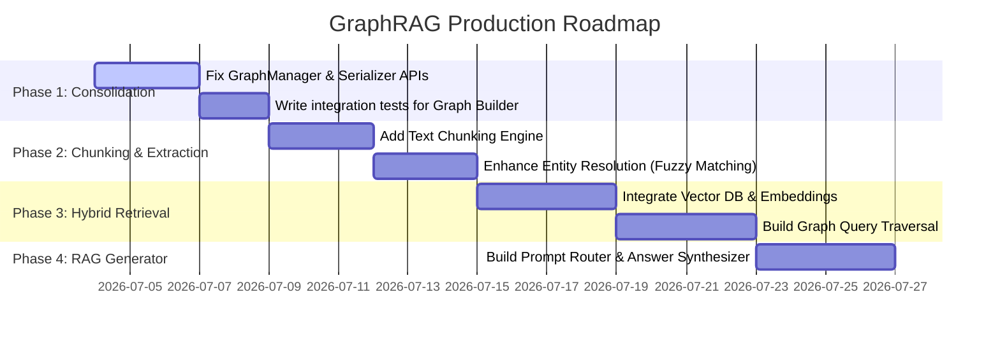

# Project Diagnosis & Next Steps Roadmap

This document provides a technical audit of the codebase, identifies issues, and outlines a prioritized roadmap to build a functional GraphRAG system.

---

## 1. Technical Audit & System Diagnosis

### What Works
- **PDF text loading** via PyMuPDF in `PDFLoader`.
- **Text cleaning and normalization** in `TextCleaner`.
- **Structured LLM prompting** and raw JSON response retrieval from Gemini (when API key is configured).
- **Ontology filtering** in `ExtractionValidator` to prune invalid relationships.
- **Deduplication and ID standardizing** in `EntityNormalizer`.
- **NetworkX graph assembly** via `GraphBuilder` and serialization via `GraphSerializer` (as JSON).

### What Fails / Bugs
- **GraphManager Import Error:** Running `from graph.graph_builder.graph_manager import GraphManager` fails because `create_node` and `create_edge` functions do not exist in `node_factory.py` or `edge_factory.py`.
- **Serializer Interface Mismatch:** 
  - `tests/test_graph_builder.py` invokes `GraphSerializer("data/graphs")` (constructor with path argument).
  - But `GraphSerializer` (`graph/graph_builder/serializer.py`) has no constructor (`__init__`) and defines only `@classmethod` or `@staticmethod` methods. The invocation `serializer.save_graphml()` will fail because the class doesn't have that method (it only has `save` and `load` for JSON).

### Architectural Inconsistencies & Technical Debt
- **Two Graph Builders:** `GraphBuilder` is a simple builder class. `GraphManager` is a full manager wrapper that attempts to split responsibility into `NodeFactory` and `EdgeFactory` but is broken. They duplicate code (e.g. both implement graph population and paper node construction).
- **Console Encoding Crash on Windows:** Running scripts can crash when printing unicode characters extracted from PDFs (e.g. `\u2217`) to cp1252 consoles.

### Missing Configurations / APIs
- **Retrieval Engine:** There is no retrieval implementation. The system has no retrieval entry points or query capability.

---

## 2. Actionable Priorities

### Priority 1: Critical Core Fixes
1. **Consolidate the Graph Layer:**
   - Remove the duplicate and broken `GraphManager`, `NodeFactory`, and `EdgeFactory` classes.
   - Keep `GraphBuilder` as the single source of truth for graph assembly.
   - Integrate save/load routines directly into `GraphBuilder` or a fixed `GraphSerializer`.
2. **Standardize the Serializer API:**
   - Align `GraphSerializer` to match the expected test interfaces (or update tests to call static methods like `GraphSerializer.save()`).
   - Add support for both JSON and GraphML formats under the unified API.

### Priority 2: Processing & Pipeline Enhancements
1. **Introduce Text Chunking:**
   - Instead of sending the full PDF content in one LLM prompt, implement a sliding window text chunker (e.g. 1000-token chunks with 200-token overlap).
   - Link entities back to specific chunk IDs to support vector retrieval context matching.
2. **Implement Entity Resolution:**
   - Enhance `EntityNormalizer` with soft matching (using Levenshtein distance or semantic embedding similarity) to merge variants like "Attention Mechanism" and "Attention layer".

### Priority 3: Retrieval & Productionization
1. **Create the Vector Storage Layer:**
   - Implement an embedding generator (e.g. using Gemini embeddings or local SentenceTransformers).
   - Save chunk embeddings to a lightweight vector database (e.g. Chroma, FAISS, or Qdrant).
2. **Build the Graph Retrieval Engine:**
   - Implement a query parser to extract entities from user prompts.
   - Add $N$-hop neighborhood traversal queries over the NetworkX graph.
3. **Build the Hybrid RAG Generation Layer:**
   - Build a generator that takes the query, retrieves matching text chunks via vector search, retrieves structural facts via graph traversal, fuses them, and prompts the LLM to generate a final answer.

---

## 3. Production Roadmap

